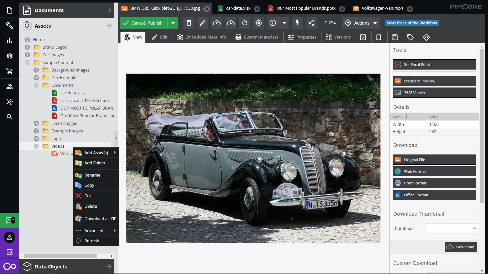
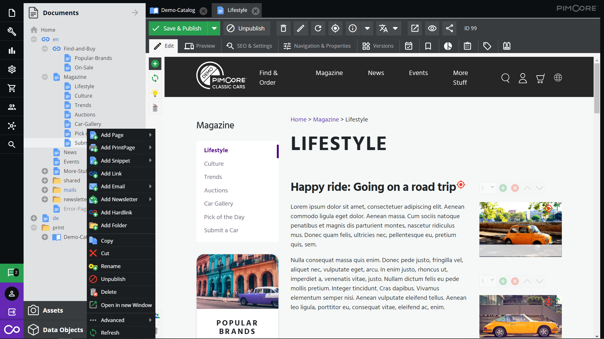

  
  
Pimcore - Open Source Data & Experience Management Platform: PIM, MDM, CDP, DAM, DXP/CMS & Digital Commerce

[](https://packagist.org/packages/pimcore/pimcore)
[](LICENSE.md)
[](https://gitter.im/pimcore/pimcore)

* 📢 **[We are hiring!](https://pimcore.com/en/careers?utm_source=github&utm_medium=readme-pimcore-pimcore&utm_campaign=careers)** - Join us on our mission!
* 🌍 [Website](https://pimcore.com/) - Learn more about Pimcore
* 📖 [Documentation](https://pimcore.com/docs/)
* 🉐 **Help translate Pimcore!** Start with [Essentials](https://poeditor.com/join/project/VWmZyvFVMH), continue with [Extended](https://poeditor.com/join/project/XliCYYgILb)
* 👍 Like us on [Facebook](https://www.facebook.com/pimcore), follow us on [LinkedIn](https://www.linkedin.com/company/3505853/) and [Twitter](https://twitter.com/pimcore)
* 🐞 [Issue Tracker](https://github.com/pimcore/pimcore/issues) - Report bugs or suggest new features
* 🗨  [Forums](https://github.com/pimcore/pimcore/discussions) - Community support and discussions
* 👪 [Community Chat](https://gitter.im/pimcore/pimcore) - Gitter
  

## Contribute  
**Bug fixes:** please create a pull request including a step by step description to reproduce the problem  
**Contribute features:** contact the core-team on our [Gitter channel](https://gitter.im/pimcore/pimcore) before you start developing   
**Security vulnerabilities:** please see our [security policy](https://github.com/pimcore/pimcore/security/policy)
  
For details, please have a look at our [contributing guide](CONTRIBUTING.md).

## Supported Versions

| Version  | Supported | LTS** | CE End of life***  |
|----------|:---------:|:-----:|:------------------:|
| `<= 4.x` |     ❌     |   ❌   |    `2017-09-28`    |
| `5.x`    |     ❌     |   ✅   |    `2019-12-09`    |
| `6.x`    |     ❌     |   ✅   |    `2021-06-23`    |
| `10.5`   |     ❌     |   ❌   |    `2023-06-21`    |
| `10.6`   |     ✅     |   ☑   |    `2023-08-16`    |
| `11.0`   |     ✅     |   ☑   |                    |
| `11.x`   |     ✅     |   ☑   |                    |

** [Long-term support](https://pimcore.com/en/services/lts) is only available as part of our [enterprise subscription](https://pimcore.com/en/platform/subscription).   
*** Community Edition end of life date, this doesn't affect the commercial LTS offering. 


## Overview


## Key Benefits and Advantages
### ⚒ Data Modelling and UI Design at the same Time 
No matter if you're dealing with unstructured web documents or structured data for MDM/PIM, you define the 
UI design (web documents by a template and structured data with an intuitive graphical editor), Pimcore knows 
how to persist the data efficiently and optimized for fast access.

### 🎛 Agnostic and Universal Framework for your Data
Due to the framework approach, Pimcore is very flexible and adapts perfectly to your needs. Built on top of 
the well-known Symfony Framework you have a solid and modern foundation for your project. 

### 🚀 Extensible and huge Symfony Community
Benefit from all existing Symfony Components and Bundles provided by the community or create your own 
Bundles to extend your Projects with reusable components. 

### 💎 Your Digital World consolidated in one Platform
No more API, import/export and synchronization hell between MDM/PIM, E-Commerce, DAM, and your Web-CMS. 
All is working seamlessly together, natively ... this is what Pimcore is built for. 

### ✨️ Modern and Intuitive UI
We love good-looking user interfaces, designed to be efficient for daily use and optimized for a great
experience for editors. 

## Preview and Demo
### Data Objects

Manage any structured data based on a predefined data model, either manually or automatically via the APIs. Define the structure and attributes of your objects by using the class editor. Manage any data – products (PIM/MDM), categories, customers (CDP), orders (digital commerce), blog articles (DXP/CMS). Data Objects provide the possibility to manage structured data for multiple output channels from a single source. By centralizing data in one place, Pimcore's data objects enable you to achieve better data completeness and data quality, allowing you to create and maintain a consistent, up-to-date customer experience across multiple touchpoints in less time.
### Digital Assets

Assets are the DAM part of Pimcore. Store, manage and organize digital files such as images, videos, PDFs, Word/Excel documents in a folder structure. Preview 200+ file types directly in Pimcore, edit pictures, and enrich files with additional meta-data. Facial recognition for focal points in images is available. Editors only need to maintain one high-resolution version of a file in the system. Pimcore can automatically generate all required output formats for various channels such as commerce, apps, websites. Of course, including comprehensive user management and version control.
### Documents

The DXP/CMS part of Pimcore for managing unstructured content such as the pages of a website and its navigation. Based on Twig templates, documents render physical HTML/CSS pages and provide the capabilities to manage the presentation of data, exactly how customers will experience it. They can be composed by administrators by arranging predefined layout elements. Pimcore documents provide multilingual and multi-site capabilities for websites, including emails and newsletters. Total frontend flexibility enables a perfect blend of content and commerce. You can also use them to create content for offline channels, such as printed catalogs (web-to-print).

#### Demo (Community Edition)
_Admin-URL_ (stable): [https://demo.pimcore.fun/admin/](https://demo.pimcore.fun/admin/)  
_Admin-URL_ (dev): [https://11.x-dev.pimcore.fun/admin/](https://11.x-dev.pimcore.fun/admin/)  
_Username_: `admin`  
_Password_: `demo`

## Getting Started
_**Only 3 commands to start!**_ 😎
```bash
COMPOSER_MEMORY_LIMIT=-1 composer create-project pimcore/skeleton ./my-project
cd ./my-project
./vendor/bin/pimcore-install
```

This will install an empty skeleton application, 
but we're also offering a demo package for your convenience - of course also with 3 commands 💪
[Click here for more installation options and a detailed guide](https://pimcore.com/docs/platform/Pimcore/Getting_Started/)

## Copyright and License 
Copyright: [Pimcore](https://www.pimcore.org) GmbH
For licensing details please visit [LICENSE.md](LICENSE.md)
