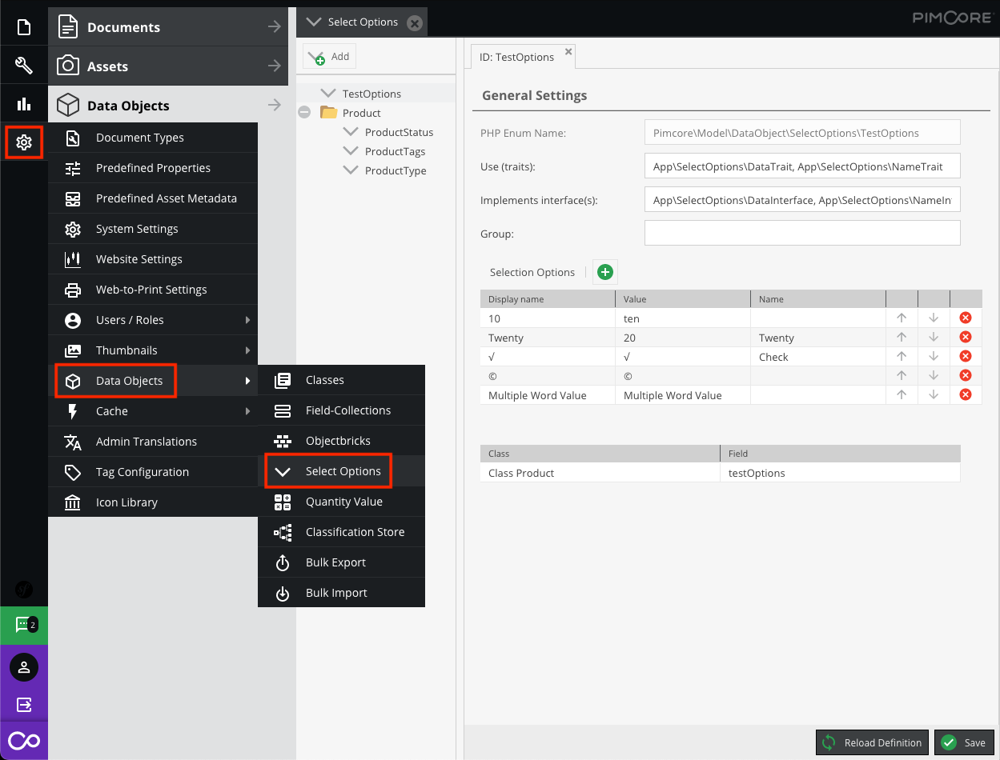
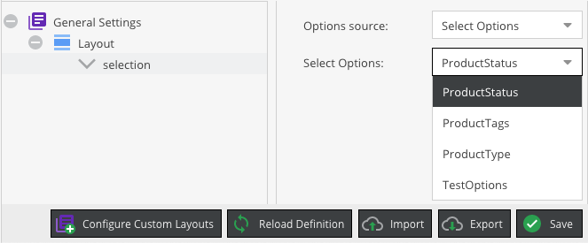

# Select Options

Select options are predefined sets of options which may be used for (multi)select fields.



The 'Name' column is optional, unless the value can't be converted to a valid PHP enum case.
This applies to values starting with a number or certain symbols.
A name may contain alphanumeric characters and underscores.

## Access restrictions

For non-admin users, access to the management interface can be enabled via
[user / role permissions](../../../22_Administration_of_Pimcore/07_Users_and_Roles.md).

Checking the 'Admin only' checkbox in the General Settings of a select options
set prevents non-admin users from deleting or editing the configuration.
This may be useful for system critical select options.

## Field configuration

Set the options source to 'Select Options' and select one of the select options sets.



## Working with PHP API

The configuration in the first screenshot generates the [backed enum](https://www.php.net/manual/en/language.enumerations.backed.php) below.

```php
<?php

namespace Pimcore\Model\DataObject\SelectOptions;

enum TestOptions: string implements \App\SelectOptions\DataInterface, \App\SelectOptions\NameInterface
{
    use \Pimcore\Model\DataObject\SelectOptions\Traits\EnumGetValuesTrait;
    use \Pimcore\Model\DataObject\SelectOptions\Traits\EnumTryFromNullableTrait;
    use \App\SelectOptions\DataTrait;
    use \App\SelectOptions\NameTrait;

    case Ten = 'ten';
    case Twenty = '20';
    case Check = '√';
    case C = '©';
    case Multiple_Word_Value = 'Multiple Word Value';

    public function getLabel(): string
    {
        return match ($this) {
            self::Ten => '10',
            self::Twenty => 'Twenty',
            self::Check => '√',
            self::C => '©',
            self::Multiple_Word_Value => 'Multiple Word Value',
        };
    }
}
```

### Retrieve available option values

Provided by the `EnumGetValuesTrait`.

```php
TestOptions::getValues();
```

### Map select value to enum

Provided by the `EnumTryFromNullableTrait`.

```php
$value = $product->getSelectField();
$testOption = TestOptions::tryFromNullable($value);
if ($testOption !== null) {
    $label = $testOption->getLabel();
}
```
