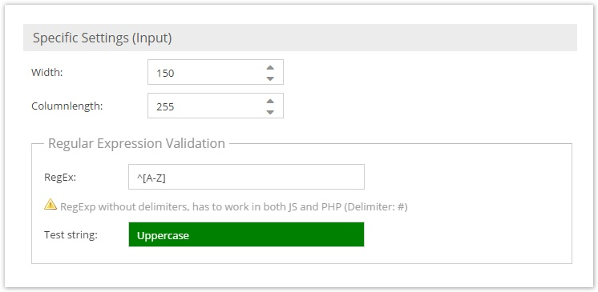
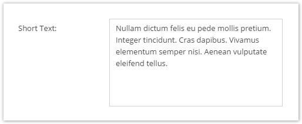
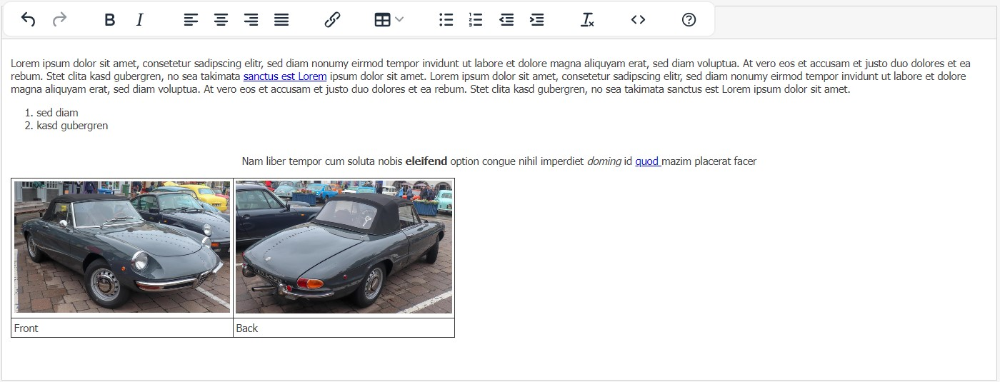

# Text Datatypes

## Input


The input field is a simple text input field. It's data is stored in a VARCHAR column in the database. The display 
width and database column length can be configured in the object class definition.





To set the value of an input field, the string value needs to be passed to the setter.

```php
$object->setInput("Some Text");
$object->save();
```


## Password


The password field is basically the same as the input field with hidden input characters. It's column length can not be 
changed, since passwords are always hashed using `password_hash` algorithm. 

To determine if a string is hashed already [password_get_info()](https://www.php.net/manual/en/function.password-get-info.php) is used. The string will not be hashed again if it is already hashed.

`password_hash` algorithm is the default hashing algorithm in Pimcore. No other hashing algorithms are currently supported. 

## Textarea



The textarea is an input widget for unformatted plain text. It is stored in a TEXT column in the database. Setting it's 
value works the same as for the input field. The width and height of the input widget can be configured in the object 
field definition.


## WYSIWYG

The WYSIWYG (What You See Is What You Get) input field is identical with the textarea field except for the fact that 
it's input widget allows formatting of text and can even hold images and links (references to assets and documents). 
If images and documents are used in a WYSIWYG widget, they create a dependency for the current object. To insert an 
image, assets can be dragged to a WYSIWYG widget. In order to create a link, a document needs to be dragged and dropped 
on selected text in the WYSIWYG widget. The text is stored as HTML. 




## Input Quantity Value

Quite similar to [Quantity Value](55_Number_Types.md) except that text values are allowed instead of the strict restriction to numeric values.
