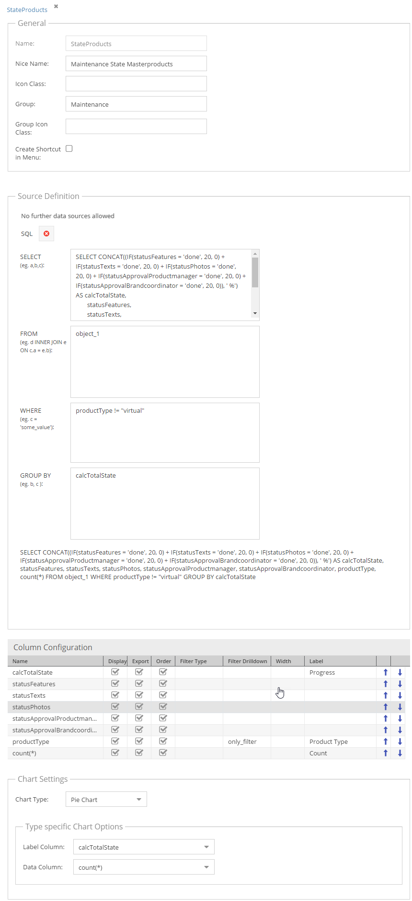

# Custom Reports
:::caution

To use this feature, please enable the `PimcoreCustomReportsBundle` in your `bundle.php` file and install it accordingly with the following command:

`bin/console pimcore:bundle:install PimcoreCustomReportsBundle`

:::

Custom Reports is a report engine directly integrated into Pimcore. With Custom Reports it is possible to create tabular
or chart reports (or both) with further filtering and export functionality.


The data source for the reports is always a source adapter which is responsible for retrieving and preparing the report
data. Currently two adapters ship with Pimcore: 
- SQL: Retrieve Data based on a SQL statement

- Google Analytics: Retrieve Data from Google Analytics only available if
  - Only available if the corresponding `PimcoreGoogleMarketingBundle` is enabled.


## Custom Report Permissions
With custom report permissions it is possible to define which users should be able to see a report. Following options 
are available:  
- `Share globally`: Custom report is visible to all users that have `reports` permission. 
- `Visible to users`: Custom report is visible to all listed users.  
- `Visible to roles`: Custom report is visible to all listed roles. 

## Custom Data Source Adapters
It is easily possible to implement custom source adapters for special use cases. To do so following steps are necessary: 

- JavaScript Class: This class defines the user interface in the configuration of the custom report. It has to be located in 
the namespace `pimcore.bundle.customreports.custom.definition`, named like the adapter (e.g. `pimcore.report.custom.definition.mySource`)
 and implement the methods `initialize`, `getElement` and `getValues`. As sample see [sql.js](https://github.com/pimcore/pimcore/blob/11.x/bundles/CustomReportsBundle/public/js/pimcore/report/custom/definitions/sql.js)
- PHP Adapter Class: This class is the server side implementation of the adapter. It is responsible for retrieving and preparing the options, columns and data. It has to extend the abstract class `Pimcore\Model\Tool\CustomReport\Adapter\AbstractAdapter` (or implement `Pimcore\Model\Tool\CustomReport\Adapter\CustomReportAdapterInterface`). As examples see [Analytics adapter](https://github.com/pimcore/google-marketing-bundle/blob/1.x/src/CustomReport/Adapter/Analytics.php) and [Sql adapter](https://github.com/pimcore/pimcore/blob/11.x/models/Tool/CustomReport/Adapter/Sql.php).
- Register your Adapter Factory as Service
   - If you are using a simple adapter class without dependency injection parameters, you can use the `DefaultCustomReportAdapterFactory` providing the adapter class' FQN as single argument
      ```yml
      app.custom_report.adapter.factory.custom:
          class: Pimcore\Bundle\CustomReportsBundle\Tool\Adapter\DefaultCustomReportAdapterFactory
          arguments:
              - 'App\CustomReport\Adapter\Custom'
      ```
    - If you are using a more complex adapter, you can create your own factory by implementing the interface `Pimcore\Bundle\CustomReportsBundle\Tool\Adapter\CustomReportAdapterFactoryInterface`
- Add your Adapter Factory to the configuration:
```yml
pimcore_custom_reports:
    adapters:
        myAdapter: app.custom_report.adapter.factory.custom
```

## Custom JS Class for Report Visualization
If you need to fully customize the appearance of the report, you can specify a custom java script class that should 
be used when opening the report in Pimcore Backend. This class can be specified in `Report Class` option and should extend
the default java script class for the reports which is `pimcore.bundle.customreports.custom.report`. 

