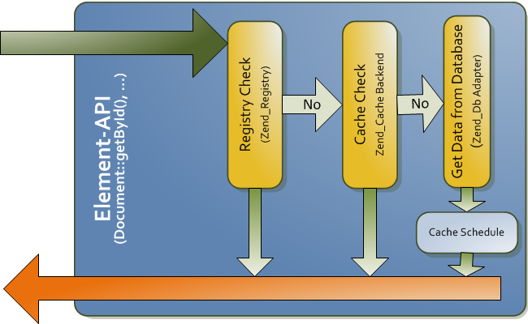

# Cache

Pimcore uses extensively caches for differently types of data. The primary cache is a pure object 
cache where every element (document, asset, object) in Pimcore is cached as it is (serialized objects). 
Every cache item is tagged with dependencies so the system is able to evict dependent objects if 
a referenced object changes.

The second cache is the output cache, which you can use either as pure page cache (configurable 
in system settings), or as in-template cache (see more at [template extensions](../../02_MVC/02_Template/02_Template_Extensions/README.md)).

The third cache is used for add-ons like the glossary, translations, database schemes, and so on. 
The behavior of the caches is controlled by the add-on itself.

All of the described caches are utilizing the `Pimcore\Cache` interface to store their objects. `Pimcore\Cache` utilizes
a `Pimcore\Cache\Core\CoreCacheHandler` to apply Pimcore's caching logic on top of a [`PSR-6`](http://www.php-fig.org/psr/psr-6/)
cache implementation which needs to implement [cache tagging](https://github.com/php-cache/tag-interop).

## Configuring the cache

Pimcore uses the `pimcore.cache.pool` Symfony cache pool, you can configure it according to your needs, but it's crucial 
that the pool supports tags.

```yaml
# config/packages/cache.yaml
framework:
    cache:
        pools:
            pimcore.cache.pool:
                public: true
                #tags: true
                default_lifetime: 31536000  # 1 year
                #adapter: pimcore.cache.adapter.doctrine_dbal
                #provider: 'doctrine.dbal.default_connection'
                adapter: cache.adapter.redis_tag_aware
                provider: 'redis://localhost'
```

By default, the cache will reuse the Doctrine connection and write to your DB's `cache_items` tables. You can override
the used connection by setting `connection` setting to a known Doctrine connection (see
[DoctrineBundle Reference](https://symfony.com/doc/current/reference/configuration/doctrine.html#doctrine-dbal-configuration)
for further information).
 
If you enable the `redis` cache configuration, the Redis cache will be used instead of the Doctrine one, even if Doctrine
is enabled as well. 
> **IMPORTANT!** It is crucial to test and verify your Redis configuration, if Pimcore is unable to connect to Redis, the entire system will stop working.


### Recommended Redis Configuration (`redis.conf`)
```
# select an appropriate value for your data
maxmemory 768mb
                   
# IMPORTANT! Other policies will cause random inconsistencies of your data!
maxmemory-policy volatile-lru   
save ""
```

> With the default settings, the minimum supported Redis version is 3.0.

> Please note that the Redis adapter currently doesn't properly support Redis Cluster setups.


## Element Cache Workflow (Asset, Document, Object)




## Using the Cache for your Application

Use the `Pimcore\Cache` facade to interact with the core cache or directly use the `Pimcore\Cache\Core\CoreCacheHandler` service.

You can use this functionality for your own application, and also to control the behavior of the Pimcore cache (but be
careful!).

If you don't need the transactional tagging functionality as used in the core you're free to use a custom cache system as
[provided by Symfony](https://symfony.com/doc/current/components/cache.html) but be aware that custom caches are not 
integrated with Pimcore's cache clearing functionality.
 
#### Example of custom usage in an action
```php
$lifetime = 99999;
$cacheKey = md5($uri);
if(!$data = \Pimcore\Cache::load($cacheKey)) {
    $data = \Pimcore\Tool::getHttpData('http://www.pimcore.org/...');
    \Pimcore\Cache::save(
        $data,
        $cacheKey,
        ["output","tag1","tag2"],
        $lifetime);
}
```

#### Overview of functionalities
```php
// disable the cache globally
\Pimcore\Cache::disable();
 
// enable the cache globally
\Pimcore\Cache::enable();
 
// invalidate caches using a tag
\Pimcore\Cache::clearTag("mytag");
 
// invalidate caches using tags
\Pimcore\Cache::clearTags(["mytag","output"]);
 
// clear the whole cache
\Pimcore\Cache::clearAll();
 
// disable the queue and limit and write immediately
\Pimcore\Cache::setForceImmediateWrite(true);
```

#### Disable the Cache for a Single Request
Sometimes it's useful to deactivate the cache for testing purposes for a single request. You 
can do this by passing the URL parameter `pimcore_nocache=true`. Note: This is only possible if you have 
enabled the `DEBUG MODE` in *Settings* > *System*

For example: `http://www.pimcore.org/download?pimcore_nocache=true` 

This will disable the entire cache, not only the output-cache. To disable only the output-cache 
you can add this URL parameter: `?pimcore_outputfilters_disabled=true`
Here you can find more [magic parameters](../15_Magic_Parameters.md).


If you want to disable the cache in your code, you can use: 
```php
\Pimcore\Cache::disable();
```

This will disable the entire cache, not only the output-cache. WARNING: Do not use this in production code!

It is also possible to just disable the output-cache in your code, read more [here](./03_Full_Page_Cache.md).


## Further Reading

* Details about output-cache - see [Output Cache](./03_Full_Page_Cache.md).
