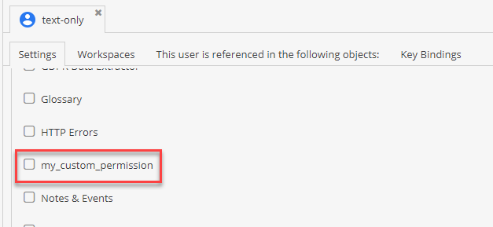

# Add Your Own Permissions

## Add your permission to the database
Choose a custom unique name and add it to the `users_permission_definitions` table in your database.
You should now be able to select the permission in the users/roles tabs:


## Verify the permission

### Inside an AdminController
```php
namespace App\Controller;

use Pimcore\Controller\UserAwareController;
use Pimcore\Controller\Traits\JsonHelperTrait;
use Symfony\Component\HttpFoundation\Request;
use Symfony\Component\HttpFoundation\Response;
use Symfony\Component\Routing\Attribute\Route;

class AdminController extends UserAwareController
{
    use JsonHelperTrait;

    #[Route('/admin/my-admin-action')]
    public function myAdminAction(Request $request): Response
    {
        $pimcoreUser = $this->getPimcoreUser();

        if ($pimcoreUser?->isAllowed('my_permission')) {
            // ...
        }
        
        return $this->jsonResponse(['success' => true]);
    }
}
```

### In the frontend (bundle)
```js
document.addEventListener(pimcore.events.pimcoreReady, (e) => {
    if(pimcore.currentuser.permissions.indexOf("my_permission") >= 0) {
        //...
    }
});
```
