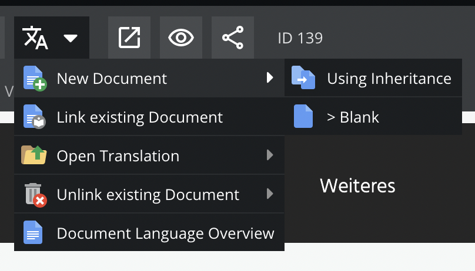

# Multilanguage i18n websites

## Best practice for multi-language websites
Every document has one single language/locale assigned. As a consequence of that, Pimcores best practice in terms of 
building multi-language websites is to build a document subtree per language. 

This has several advantages:
* Localized document keys, URLs and navigation structures
* Clean structure about where to find which content
* Transparent permission management based on the document tree
* etc. 

Pimcore provides two additional features to support editors in translating and managing documents for several languages: 

### Localization Tool

The localization tool for Pimcore documents is a comfort tool which supports creation and management of the same document
 for multiple languages. It can be accessed in the editor button row of every document. 

Following features are supported: 
* **Creating new documents** for another language - either an empty document or and document using content inheritance (see below)
* **Link existing documents** in order to have the language link between documents
* **Open Translation** to quickly navigate to the corresponding document in another language. 

### Content Inheritance
Content inheritance is a Pimcore feature to save duplicate data maintenance within documents. This feature is quite handy
in multi language document structures in order to maintain language independent content only once. 

For details see [Document Inheritance / Content Main Document](../03_Documents/11_Inheritance.md).
